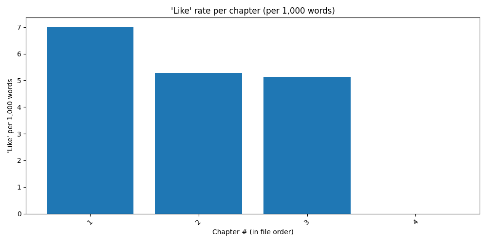

# 📊 Style Expression Report — 'Like', Crutch Words & Clichés
_Generated: 2025-12-23 21:14:05_

**Total word count:** 7,763
**Total 'like' occurrences:** 45

### 📘 Reference Benchmarks
_(For comparison — approximate word and 'like' counts)_

- **Raising Steam (Terry Pratchett)**: 126,097 words, 453 'like' occurrences
- **Long Call (Cleeves)**: 105,816 words, 262 'like' occurrences
- **American Gods (Neil Gaiman)**: 217,087 words, 735 'like' occurrences
- **House Cerulean (Klune)**: 116,621 words, 392 'like' occurrences

## 🔎 Crutch Word Overview (per 10,000 words)

| Word | Raw count | per 10k words | Threshold | Note |
|------|-----------|--------------|-----------|------|
| `just` | 14 | 18.0 | 60 |  |
| `like` | 45 | 58.0 | 80 |  |
| `really` | 3 | 3.9 | 40 |  |
| `suddenly` | 0 | 0.0 | 20 |  |
| `very` | 0 | 0.0 | 30 |  |

## 🔁 Repeated 'like [noun]' Patterns (Normalized)
_No repeated 'like [noun]' patterns found._

---

## 📍 Locations of Repeated 'like [noun]' Phrases
_No matching occurrences found for repeated phrases._

---

## 🧾 Cliché Phrase Report

✅ No clichés found based on the configured list.
